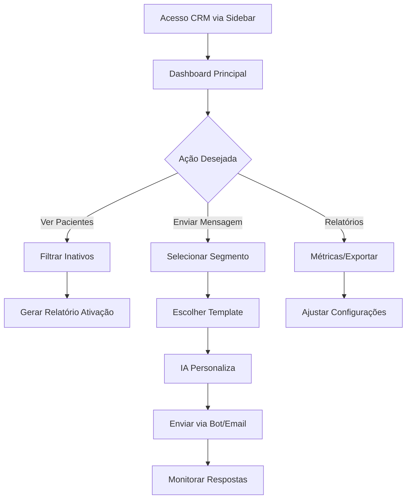

# Documentação Completa: Módulo CRM do Sistema Alt Clinic

## 📋 Índice

- [1. Premissas Gerais do Módulo CRM](#1-premissas-gerais-do-módulo-crm)
- [2. Visão Geral do Menu de CRM](#2-visão-geral-do-menu-de-crm)
- [3. Análise de Requisitos](#3-análise-de-requisitos)
- [4. Regras de Negócio](#4-regras-de-negócio)
- [5. Funcionalidades](#5-funcionalidades)
- [6. Fluxo de Uso](#6-fluxo-de-uso)
- [7. Plano de Implementação](#7-plano-de-implementação)

---

## 1. Premissas Gerais do Módulo CRM

### Objetivo Principal

O módulo CRM do Alt Clinic é um auxiliar inteligente para gestão de relacionamentos com pacientes em clínicas de qualquer área da saúde (estética, odontologia, fisioterapia, medicina geral).

### Pilares Fundamentais

#### 🤖 **Máxima Automação**

- Envio de mensagens via bots (WhatsApp/Telegram) e emails (Mailchimp free tier)
- Cron jobs para verificações periódicas (inatividade, aniversários)
- Integração com agendamento/financeiro para triggers automáticos

#### 🧠 **Inteligência Artificial**

- APIs gratuitas (Google Gemini para análise de sentimentos)
- Hugging Face para segmentação baseada em padrões comportamentais
- Sugestões personalizadas de campanhas

#### 🏥 **Alinhamento ao Dia a Dia da Clínica**

- Acompanhamento pós-procedimento
- Reativação de pacientes inativos (reduzindo perda de 20-30% de receita)
- Relatórios para upsell ("Pacientes de Botox propensos a peeling")
- Compliance LGPD para dados de contato

### Tech Stack

- **Frontend**: React.js com listas interativas e gráficos
- **Backend**: Node.js com cron jobs (node-cron)
- **Integrações**: Bots gratuitos, Mailchimp free tier
- **Banco**: SQLite/PostgreSQL relacional

---

## 2. Visão Geral do Menu de CRM

### Estrutura de Navegação

```
📱 CRM (Sidebar)
├── 💬 Mensagens/Comunicações
├── 👥 Clientes/Pacientes
├── 📊 Relatórios/Analytics
└── ⚙️ Configurações
```

### Dashboard Principal

- Taxa de retenção mensal
- Engajamento geral
- Pacientes inativos (alertas)
- Próximas ações automáticas

### Integrações

- **Agendamento**: Status de consultas
- **Financeiro**: Valor gasto por paciente
- **Visão 360°**: Histórico completo do paciente

---

## 3. Análise de Requisitos

### 3.1 Requisitos Funcionais

| ID   | Categoria   | Requisito                           | Prioridade |
| ---- | ----------- | ----------------------------------- | ---------- |
| RF01 | Contatos    | Cadastro e segmentação de pacientes | Alta       |
| RF02 | Comunicação | Envios automáticos via bot/email    | Alta       |
| RF03 | Comunicação | Templates personalizáveis           | Média      |
| RF04 | Analytics   | Relatórios de performance           | Alta       |
| RF05 | Integração  | Conexão com bots reais              | Média      |
| RF06 | IA          | Análise de sentimentos              | Baixa      |

### 3.2 Requisitos Não Funcionais

| ID    | Categoria      | Requisito               | Meta        |
| ----- | -------------- | ----------------------- | ----------- |
| RNF01 | Performance    | Processamento de envios | <5s         |
| RNF02 | Performance    | Geração de relatórios   | <10s        |
| RNF03 | Segurança      | Criptografia de dados   | 256-bit     |
| RNF04 | Segurança      | Consentimento LGPD      | 100%        |
| RNF05 | Usabilidade    | Interface intuitiva     | Score >8/10 |
| RNF06 | Escalabilidade | Suporte de pacientes    | >10.000     |

---

## 4. Regras de Negócio

### 4.1 Regras Gerais

| Regra    | Descrição                                                    |
| -------- | ------------------------------------------------------------ |
| **RN01** | Todo envio requer consentimento do paciente (opt-in/opt-out) |
| **RN02** | Limite anti-spam: Máximo 1 mensagem/dia por paciente         |
| **RN03** | Evitar envios se resposta recente <7 dias                    |
| **RN04** | Integração obrigatória com módulos existentes                |

### 4.2 Regras de Mensagens

| Regra    | Trigger                   | Ação                            |
| -------- | ------------------------- | ------------------------------- |
| **RN05** | Consulta marcada          | Envio automático de confirmação |
| **RN06** | Paciente inativo >90 dias | Envio de oferta personalizada   |
| **RN07** | Pós-atendimento           | Envio de NPS via bot            |
| **RN08** | Personalização            | Templates com placeholders      |

### 4.3 Regras de Segmentação

| Regra    | Critério         | Automação                        |
| -------- | ---------------- | -------------------------------- |
| **RN09** | Alto valor       | Gasto >R$1k/ano                  |
| **RN10** | Inativo propenso | IA predição via Hugging Face     |
| **RN11** | Privacidade      | Não compartilhar sem autorização |
| **RN12** | Anonimização     | Relatórios sem dados pessoais    |

---

## 5. Funcionalidades

### 5.1 Tabela Completa de Funcionalidades

| Categoria      | Funcionalidade       | Descrição                                                     | Automação/IA                          | Frontend                        | MVP |
| -------------- | -------------------- | ------------------------------------------------------------- | ------------------------------------- | ------------------------------- | --- |
| **Mensagens**  | Envios Automáticos   | Mensagens para consulta marcada/desmarcada/remarcada/inativos | ✅ Triggers + IA personalização       | Lista templates + preview       | ✅  |
| **Mensagens**  | Envios Manuais       | Composição e envio personalizado para segmentos               | ✅ Sugestões + análise sentimentos    | Editor + filtros                | ✅  |
| **Clientes**   | Segmentação          | Criação de grupos (inativos, alto valor, especialidade)       | ✅ Clustering automático              | Tabela + tags + filtros         | ✅  |
| **Clientes**   | Histórico Interações | Log de mensagens, respostas e engajamento                     | ✅ Registro automático + resumo IA    | Timeline visual + busca         | ✅  |
| **Relatórios** | Ativação de Vendas   | Lista de inativos com sugestões de contato/ofertas            | ✅ Geração semanal + priorização IA   | Tabela exportável + gráficos    | ✅  |
| **Relatórios** | Métricas Engajamento | Taxa abertura, cliques, conversões, NPS agregado              | ✅ Rastreio automático + insights IA  | Dashboard KPIs + filtros        | ✅  |
| **Config**     | Templates e Canais   | Configuração mensagens, integração bots/Mailchimp             | ✅ Validação + sugestões IA           | Formulários + teste integrações | ✅  |
| **Expansão**   | Campanhas Marketing  | Criação campanhas sazonais (aniversário, promoções)           | ✅ Disparo programado + otimização IA | Wizard + preview multicanal     | ❌  |
| **Expansão**   | Feedbacks e NPS      | Envio pesquisas pós-atendimento                               | ✅ 24h após consulta + análise IA     | Formulário + dashboard scores   | ❌  |

### 5.2 Priorização MVP vs Expansões

#### 🟢 **MVP (Implementação Imediata)**

1. Envios automáticos básicos
2. Segmentação simples
3. Relatórios essenciais
4. Templates configuráveis

#### 🟡 **Fase 2 (Após MVP)**

1. Integração com IA
2. Campanhas avançadas
3. NPS automático
4. Analytics detalhados

---

## 6. Fluxo de Uso

### 6.1 Fluxo Principal



### 6.2 Casos de Uso Detalhados

#### **UC01: Reativar Paciente Inativo**

1. Sistema detecta paciente inativo >90 dias
2. IA analisa histórico e sugere oferta
3. Usuário revisa e aprova mensagem
4. Envio automático via WhatsApp
5. Monitoramento de resposta

#### **UC02: Campanha de Aniversário**

1. Cron job detecta aniversários do mês
2. IA personaliza mensagem com procedimentos favoritos
3. Agendamento automático de envios
4. Rastreamento de conversões

---

## 7. Plano de Implementação

### 7.1 Etapas de Desenvolvimento

#### **ETAPA 1: Estrutura Base (Semana 1-2)**

- [ ] Criação da página CRM principal
- [ ] Sidebar com menu CRM
- [ ] Dashboard básico com métricas mock
- [ ] Estrutura de rotas `/crm/*`

**Arquivos a criar:**

```
frontend/src/pages/crm/
├── CRMDashboard.js
├── MensagensPage.js
├── ClientesPage.js
├── RelatoriosPage.js
└── ConfiguracoesPage.js

frontend/src/components/crm/
├── DashboardMetrics.js
├── PacientesList.js
├── MessageTemplate.js
└── SegmentFilter.js

frontend/src/hooks/crm/
└── useCRM.js

frontend/src/data/crm/
└── mockCRMData.js
```

#### **ETAPA 2: Gestão de Pacientes (Semana 3)**

- [ ] Lista de pacientes com filtros
- [ ] Segmentação básica
- [ ] Histórico de interações
- [ ] Tags e categorização

#### **ETAPA 3: Sistema de Mensagens (Semana 4)**

- [ ] Templates de mensagens
- [ ] Envios manuais
- [ ] Preview de mensagens
- [ ] Log de envios

#### **ETAPA 4: Automação Básica (Semana 5)**

- [ ] Triggers de agendamento
- [ ] Detecção de inativos
- [ ] Envios automáticos
- [ ] Cron jobs básicos

#### **ETAPA 5: Relatórios e Analytics (Semana 6)**

- [ ] Relatório de ativação
- [ ] Métricas de engajamento
- [ ] Exportação de dados
- [ ] Gráficos interativos

#### **ETAPA 6: Backend e Integrações (Semana 7-8)**

- [ ] APIs REST para CRM
- [ ] Integração com banco de dados
- [ ] Conexão com sistema de agendamento
- [ ] Preparação para bots

### 7.2 Tecnologias por Etapa

| Etapa | Frontend            | Backend          | Integrações   |
| ----- | ------------------- | ---------------- | ------------- |
| 1-2   | React + Material-UI | Dados mock       | Nenhuma       |
| 3-4   | + React Query       | Express + SQLite | Agendamento   |
| 5-6   | + Charts.js         | + Cron jobs      | Financeiro    |
| 7-8   | + Formulários       | + APIs REST      | Bots (futuro) |

### 7.3 Critérios de Aceite

#### **MVP Mínimo**

- [ ] Dashboard funcional com métricas
- [ ] Lista de pacientes segmentáveis
- [ ] Envio manual de mensagens
- [ ] Relatório básico de inativos
- [ ] Configuração de templates

#### **MVP Completo**

- [ ] Envios automáticos funcionais
- [ ] Integração com agendamento
- [ ] Métricas de engajamento
- [ ] Exportação de relatórios
- [ ] Interface responsiva

---

## 8. Próximos Passos

### Implementação Imediata

1. **Criar estrutura base** do módulo CRM
2. **Implementar dashboard** com métricas mock
3. **Desenvolver lista de pacientes** com filtros básicos
4. **Criar sistema de templates** de mensagens

### Roadmap Futuro

1. **Integração com IA** (Google Gemini, Hugging Face)
2. **Conexão com bots** reais (WhatsApp, Telegram)
3. **Sistema de NPS** automático
4. **Campanhas avançadas** sazonais

---

**📞 CRM Alt Clinic - Transformando relacionamentos em resultados!**
