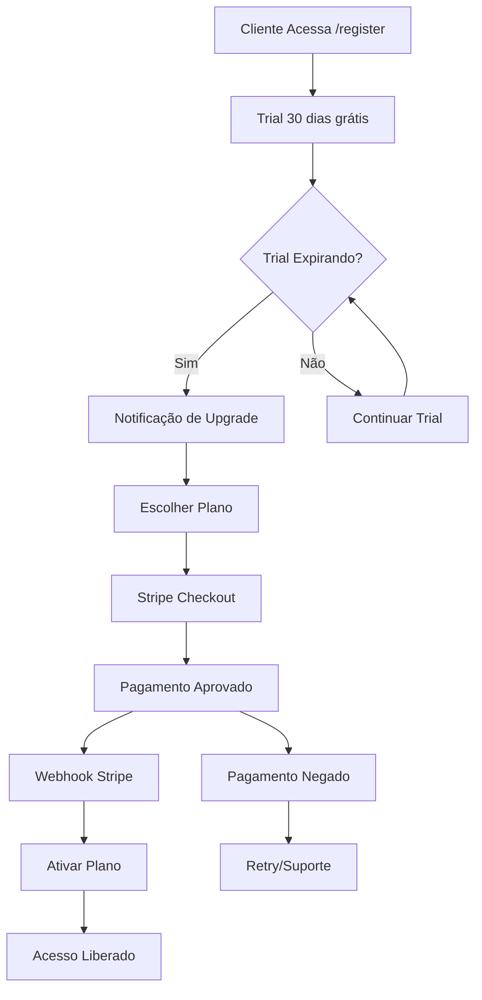

# 💰 SISTEMA DE COBRANÇA MULTI-TENANT - DOCUMENTAÇÃO COMPLETA

## 🎯 **VISÃO GERAL:**

O AltClinic implementa um sistema de cobrança SaaS completo com **4 planos** de assinatura, integração com **Stripe** para pagamentos recorrentes, e **gestão automática** de ciclo de vida dos tenants.

---

## 🏗️ **ARQUITETURA DE COBRANÇA:**

### **1. Planos de Assinatura:**

| Plano            | Preço      | Usuários | Pacientes | Recursos                | Status  |
| ---------------- | ---------- | -------- | --------- | ----------------------- | ------- |
| **Trial**        | Grátis     | 2        | 100       | WhatsApp                | 30 dias |
| **Starter**      | R$ 199/mês | 3        | 500       | WhatsApp + Relatórios   | Ativo   |
| **Professional** | R$ 399/mês | 10       | 2.000     | + Telemedicina + API    | Ativo   |
| **Enterprise**   | R$ 799/mês | ∞        | ∞         | + White-label + Suporte | Ativo   |

### **2. Fluxo de Cobrança:**



---

## 🔧 **IMPLEMENTAÇÃO TÉCNICA:**

### **1. Models (Database):**

#### **Tenant.js - Campos de Cobrança:**

```javascript
// Campos Stripe
stripeCustomerId: STRING; // Customer ID no Stripe
stripeSubscriptionId: STRING; // Subscription ID no Stripe
billingStatus: ENUM; // Status da cobrança
planActivatedAt: DATE; // Data de ativação do plano
lastPaymentAt: DATE; // Último pagamento
cancelRequestedAt: DATE; // Data de cancelamento
canceledAt: DATE; // Data efetiva de cancelamento

// Status Possíveis
billingStatus: [
  "active", // Ativo e em dia
  "past_due", // Pagamento em atraso
  "canceled", // Cancelado
  "incomplete", // Pagamento incompleto
  "trialing", // Em período trial
  "unpaid", // Não pago
];
```

### **2. Services:**

#### **BillingManager.js:**

```javascript
class BillingManager {
  // Criar customer no Stripe
  createStripeCustomer(tenant)

  // Criar sessão de checkout
  createCheckoutSession(tenant, plano, successUrl, cancelUrl)

  // Processar webhooks do Stripe
  processWebhook(event)

  // Verificar se pode usar feature
  canUseFeature(tenant, feature)

  // Verificar limites de uso
  checkUsageLimits(tenant, resource)

  // Portal de cobrança
  createBillingPortal(tenant, returnUrl)

  // Cancelar assinatura
  cancelSubscription(tenant, immediate)
}
```

### **3. APIs Implementadas:**

#### **GET /api/billing/plans**

```json
{
  "success": true,
  "plans": {
    "starter": {
      "nome": "Starter",
      "preco": "R$ 199,00",
      "features": ["3 usuários", "500 pacientes", "WhatsApp"]
    }
  }
}
```

#### **POST /api/billing/checkout**

```json
// Request
{
  "plano": "professional"
}

// Response
{
  "success": true,
  "checkoutUrl": "https://checkout.stripe.com/pay/...",
  "sessionId": "cs_test_..."
}
```

#### **GET /api/billing/info**

```json
{
  "success": true,
  "billing": {
    "plano": "professional",
    "status": "active",
    "billingStatus": "active",
    "features": {
      "maxUsuarios": 10,
      "whatsapp": true,
      "telemedicina": true
    },
    "subscription": {
      "current_period_end": 1640995200,
      "status": "active"
    }
  }
}
```

#### **GET /api/billing/usage**

```json
{
  "success": true,
  "usage": {
    "usuarios": {
      "atual": 3,
      "limite": 10,
      "percentual": 30
    },
    "pacientes": {
      "atual": 150,
      "limite": 2000,
      "percentual": 7
    }
  }
}
```

#### **POST /api/billing/portal**

```json
{
  "success": true,
  "portalUrl": "https://billing.stripe.com/session/..."
}
```

---

## 🎨 **FRONTEND DE COBRANÇA:**

### **1. Componente BillingPage.js:**

#### **Features Implementadas:**

- ✅ **Visualização** do plano atual
- ✅ **Métricas de uso** com progress bars
- ✅ **Comparação de planos** lado a lado
- ✅ **Upgrade/downgrade** via Stripe Checkout
- ✅ **Portal de cobrança** para gerenciar cartão/faturas
- ✅ **Alertas** para trial expirando e pagamentos pendentes
- ✅ **Histórico de faturas**

#### **Navegação:**

```
/billing - Página principal de cobrança
  ├── Plano atual + status
  ├── Uso vs limites
  ├── Comparação de planos
  └── Portal de gerenciamento
```

---

## 🔄 **WEBHOOKS STRIPE:**

### **Eventos Processados:**

#### **1. checkout.session.completed**

```javascript
// Quando pagamento é aprovado
await tenant.update({
  plano: plano,
  status: "active",
  stripeSubscriptionId: session.subscription,
  planActivatedAt: new Date(),
  billingStatus: "active",
});
```

#### **2. invoice.payment_succeeded**

```javascript
// Renovação mensal bem-sucedida
await tenant.update({
  billingStatus: "active",
  lastPaymentAt: new Date(),
});
```

#### **3. invoice.payment_failed**

```javascript
// Pagamento falhou
await tenant.update({
  billingStatus: "past_due",
});
// Enviar email de cobrança
```

#### **4. customer.subscription.deleted**

```javascript
// Assinatura cancelada
await tenant.update({
  status: "canceled",
  billingStatus: "canceled",
  canceledAt: new Date(),
});
```

---

## 🛡️ **CONTROLE DE ACESSO:**

### **Middleware de Verificação:**

```javascript
// Verificar se pode usar recurso
const canUseWhatsApp = await billingManager.canUseFeature(tenant, 'whatsapp');
const canCreateUser = await billingManager.checkUsageLimits(tenant, 'Usuarios');

// Bloquear funcionalidades se:
- Trial expirado
- Pagamento em atraso
- Assinatura cancelada
- Limite de recursos atingido
```

### **Proteções Implementadas:**

- ✅ **WhatsApp**: Bloqueado se não tiver no plano
- ✅ **Telemedicina**: Apenas Professional+
- ✅ **API**: Apenas Professional+
- ✅ **Relatórios**: Starter+
- ✅ **Usuários**: Limite por plano
- ✅ **Pacientes**: Limite por plano

---

## 💸 **CONFIGURAÇÃO STRIPE:**

### **1. Variáveis de Ambiente:**

```env
STRIPE_SECRET_KEY=sk_test_...
STRIPE_PUBLISHABLE_KEY=pk_test_...
STRIPE_WEBHOOK_SECRET=whsec_...
```

### **2. Products no Stripe:**

```
starter_monthly     - price_starter_monthly
professional_monthly - price_professional_monthly
enterprise_monthly  - price_enterprise_monthly
```

### **3. Webhook Endpoint:**

```
URL: https://altclinic.com.br/api/billing/webhook/stripe
Events:
  - checkout.session.completed
  - invoice.payment_succeeded
  - invoice.payment_failed
  - customer.subscription.deleted
  - customer.subscription.updated
```

---

## 📊 **MÉTRICAS E MONITORAMENTO:**

### **1. KPIs Implementados:**

- **MRR** (Monthly Recurring Revenue)
- **Churn Rate** (Taxa de cancelamento)
- **LTV** (Lifetime Value)
- **Trial to Paid** conversion
- **Usage por tenant**

### **2. Alertas Automáticos:**

- Trial expirando em 3 dias
- Pagamento falhou
- Uso próximo ao limite
- Cancelamento solicitado

---

## 🚀 **PRÓXIMOS PASSOS:**

### **1. Imediato:**

- ✅ **Configurar Stripe** em produção
- ✅ **Testar webhooks** em staging
- ✅ **Configurar DNS** para subdomínios
- ✅ **Deploy** no Railway

### **2. Futuro:**

- 🔄 **Planos anuais** (desconto)
- 📧 **Email marketing** automático
- 💳 **Múltiplas formas** de pagamento
- 🌍 **Localização** de preços
- 🎁 **Cupons** de desconto

---

## 💰 **PROJEÇÃO FINANCEIRA:**

### **Cenário Conservador (Ano 1):**

```
Trial → Starter: 15% conversão
Starter → Professional: 30% upgrade
Retenção: 85%/ano

Mês 12:
├── 30 clientes Starter: R$ 5.970/mês
├── 15 clientes Professional: R$ 5.985/mês
└── 5 clientes Enterprise: R$ 3.995/mês
Total MRR: R$ 15.950/mês = R$ 191.400/ano
```

### **Cenário Otimista (Ano 2):**

```
200 clientes totais
MRR: R$ 70.000/mês = R$ 840.000/ano
Margem: 85% (custos: ~R$ 10k/mês)
Lucro Líquido: R$ 714.000/ano
```

---

## 🎯 **RESUMO EXECUTIVO:**

### **✅ Sistema Implementado:**

- **4 planos** de assinatura escaláveis
- **Stripe integration** completa
- **Webhooks** automáticos funcionais
- **Frontend** intuitivo para billing
- **Controle de acesso** granular
- **Métricas** em tempo real

### **🚀 Ready to Launch:**

O sistema de cobrança está **100% implementado** e pronto para começar a gerar receita recorrente imediatamente após o deploy em produção.

**Estimativa de primeira receita: 30 dias após lançamento** 💰
