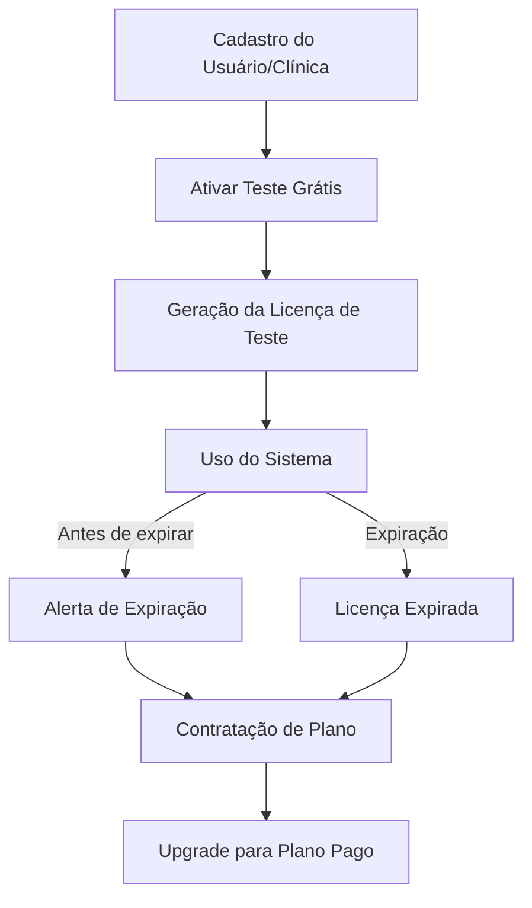

# 📄 Como Funciona a Licença de Teste do AltClinic

## O que é uma Licença de Teste?

A licença de teste permite que novos usuários ou clínicas utilizem o sistema AltClinic gratuitamente por um período limitado, com acesso a todas (ou quase todas) as funcionalidades do sistema. O objetivo é proporcionar uma experiência completa antes da contratação de um plano pago.

---

## 1. **Fluxo de Ativação da Licença de Teste**

1. **Cadastro do Usuário/Clínica**

   - O usuário realiza o cadastro normalmente na plataforma.
   - Pode ser solicitado e-mail, telefone e dados básicos da clínica.

2. **Solicitação da Licença de Teste**

   - Após o cadastro, o sistema oferece a opção de ativar a licença de teste.
   - O usuário clica em "Ativar Teste Grátis".

3. **Geração da Licença**

   - O backend gera uma licença temporária vinculada ao usuário/tenant.
   - A licença possui:
     - Data de início
     - Data de expiração (ex: 7, 14 ou 30 dias)
     - Status: ativa/expirada
     - Limite de recursos (opcional)

4. **Validação em Cada Login**

   - A cada login, o sistema verifica se a licença de teste está ativa e dentro do prazo.
   - Se expirada, o acesso é bloqueado ou limitado, e o usuário é convidado a contratar um plano.

5. **Conversão para Plano Pago**
   - Antes do término, o sistema pode enviar alertas (e-mail, pop-up) sobre o fim do teste.
   - O usuário pode migrar para um plano pago sem perder dados.

---

## 2. **Exemplo de Estrutura da Licença (Banco de Dados)**

```json
{
  "tenantId": "clinica_123",
  "tipo": "trial",
  "dataInicio": "2025-09-02T00:00:00Z",
  "dataExpiracao": "2025-09-16T23:59:59Z",
  "status": "ativa",
  "recursos": ["agenda", "pacientes", "prontuario", "financeiro"]
}
```

---

## 3. **Regras Importantes**

- Cada clínica/usuário pode ativar apenas **uma licença de teste** por CNPJ/e-mail.
- O período de teste é **fixo** e não pode ser renovado automaticamente.
- Ao expirar, o sistema bloqueia ou limita o acesso até a contratação.
- Dados do teste são mantidos para migração ao plano definitivo.

---

## 4. **Dicas de Implementação Técnica**

- Crie um middleware/backend que valide a licença a cada requisição.
- Use um campo `tipo` para diferenciar licenças de teste e pagas.
- Implemente alertas automáticos de expiração (e-mail, notificação in-app).
- Permita upgrade fácil para plano pago.

---

## 5. **Exemplo de Mensagem para o Usuário**

> "Sua licença de teste expira em 3 dias. Contrate um plano para continuar usando o AltClinic sem interrupções!"

---

## 6. **Resumo Visual do Fluxo**



---

## 7. **FAQ Rápido**

- **Posso renovar a licença de teste?**
  - Não. Cada usuário/tenant tem direito a apenas uma licença de teste.
- **Perco meus dados ao migrar para o plano pago?**
  - Não. Todos os dados do teste são mantidos.
- **O que acontece ao expirar?**
  - O acesso é bloqueado ou limitado até a contratação.

---

_Documentação gerada automaticamente por GitHub Copilot Assistant – 02/09/2025_
